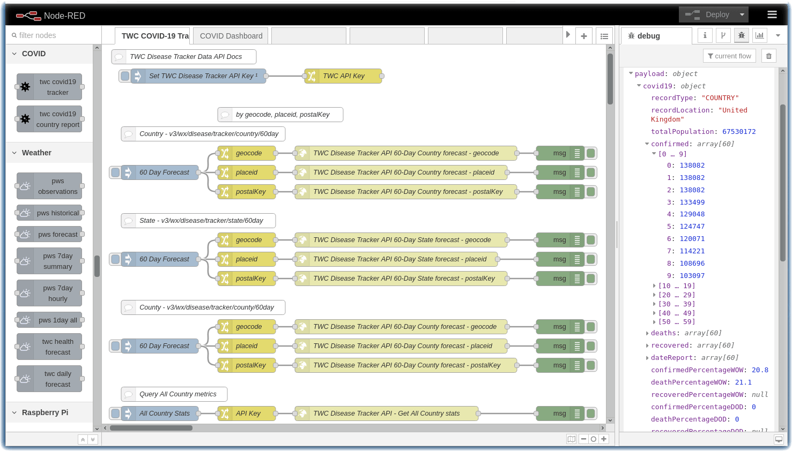
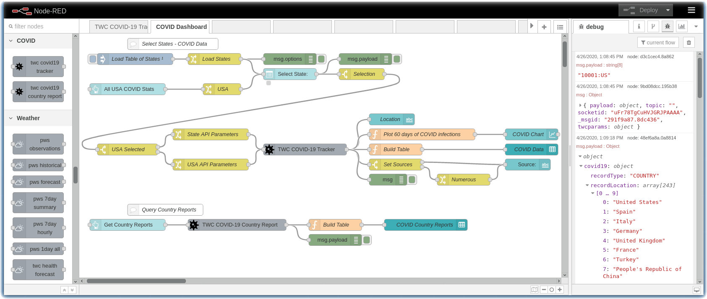
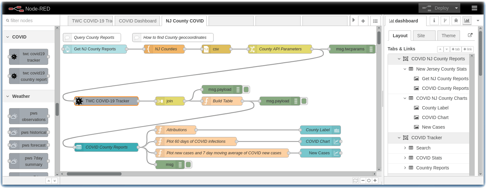
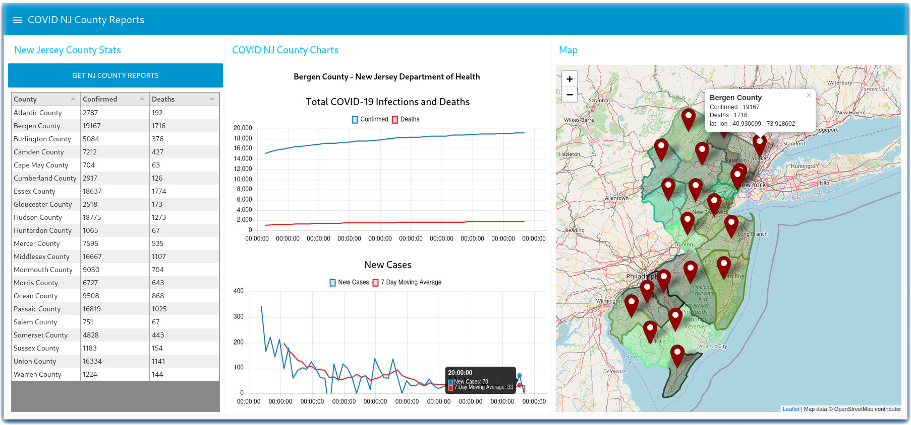

# node-red-contrib-twc-covid19-tracker
Node-RED node for The Weather Company (TWC) COVID-19 Disease Tracking API

These nodes implements the [TWC APIs for COVID-19 Disease Tracking](https://weather.com/swagger-docs/ui/sun/v3/sunV3DiseaseTracker.json).

The API allows you to track the progression of a disease for a given location.  It provides information regarding active diseases including confirmed cases, deaths, and recoveries over a period of up to 60 days in the past.


## Install

Either use the Editor - Menu - Manage Palette - Install option, or run the following command in your Node-RED user directory (typically `~/.node-red`).
```
$ npm install node-red-contrib-twc-covid19-tracker
```

## Register

To use **The Weather Company API for COVID-19 Disease Tracking**, you need an **API key**.  [Call for Code](https://developer.ibm.com/callforcode) participants can register to join the [Call for Code 2020 COVID Challenge](https://developer.ibm.com/callforcode/getstarted/covid-19/) and request a TWC API key for this Node-RED node at [callforcode.weather.com](https://callforcode.weather.com) A time-limited API key will be sent to you via email.

## node-red-contrib-twc-covid19-tracker Nodes

This Node-RED package creates **twc covid19 tracker** and **twc covid19 country report** nodes in your Node-RED palette.
- **twc covid19 tracker** - Query 60 day history of COVID-19 statistics at the Country, State, County level by Geocode, Place ID or Postal Code.
- **twc covid19 country report** - Query the current state of a disease for a set of countries globally.

Review the [CHANGELOG](https://github.com/call-for-code/node-red-contrib-twc-covid19-tracker/blob/master/CHANGELOG.md) for enhancement history.

### Explore the node-red-contrib-twc-covid19-tracker Node-RED node

Once the node is installed in your Node-RED palette, drag it to your flow and double-click on the **twc covid tracker** node. In the **Properties** dialog box enter the following information:

* Your TWC API Key provided by [callforcode.weather.com](https://callforcode.weather.com)
* Specify whether the node will retrieve **country**, **state** or **county** COVID-19 data
* Specify the location you are interested in; **geocode** latitude/longitude, **Place ID**, or **Postal Key**
* The location either via latitude/longitude, place id or postal code.  Examples:
  * 40.74,-73.99
  * 327145917e06d09373dd2760425a88622a62d248fd97550eb4883737d8d1173b
  * 10001:US

Review the node information documentation in the Node-RED right hand side bar for techniques that allow you to programmatically pass in the above parameters via a *msg.twcparams* json object.


## Review the TWC Disease Tracker API documentation

The Weather Company offers [TWC Weather Data Packages](https://business.weather.com/products/weather-data-packages) that are available for purchase. The Node-RED node in this package implements the Disease Tracking API service and is free for Call for Code participants (please review the [Terms of Service](https://callforcode.weather.com/register/))

The TWC Disease Tracker API allows you to track the progression of the COVID-19 disease for a given location. It provides information regarding active diseases including confirmed cases, deaths, and recoveries over a period of up to 60 days in the past.

See the [online documentation](https://weather.com/swagger-docs/ui/sun/v3/sunV3DiseaseTracker.json) for more information about The Weather Company API for Disease Tracking.

See the [online documentation](https://weather.com/swagger-docs/ui/sun/v3/sunV3DiseaseTrackerCountryList.json) for more information about The Weather Company API for Global Disease Country Reporting.

The APIs returns an array of json objects containing COVID-19 data which you can integrate into dashboards or applications.

## Tutorials

For a full tutorial with instructions, screenshots and examples, review the IBM Developer
[Build a Node-RED COVID-19 dashboard](https://developer.ibm.com/tutorials/build-a-node-red-covid-19-dashboard-using-twc-disease-tracker-api/) tutorial.

## Examples

Learn how to implement a Node-RED COVID-19 statistics dashboard using The Weather Company Disease Tracker API.

Access COVID-19 location and infection data through an API provided by **The Weather Company** (TWC) and incorporate that data in
Node-RED dashboard, charts, and tables. Use Node-RED for data analysis and data visualization of COVID-19 infections
by country, state and county.

Three examples are provided in the [examples](https://github.com/call-for-code/node-red-contrib-twc-covid19-tracker/tree/master/examples) folder.

___
#### Example #1

- Test each of the TWC COVID-19 APIs by importing this [covid19-api-test.json](https://github.com/call-for-code/node-red-contrib-twc-covid19-tracker/blob/master/examples/covid19-api-test.json) flow.



___
#### Example #2

- This example Node-RED Dashboard displays 60 days of USA State COVID-19 historical data in a table and on a chart.
- This example requires some additional dependencies:
  - [node-red-node-ui-table](https://flows.nodered.org/node/node-red-node-ui-table)
  - [node-red-dashboard](https://flows.nodered.org/node/node-red-dashboard)
- Import this [Node-RED-covid19-dashboard.json](https://github.com/call-for-code/node-red-contrib-twc-covid19-tracker/blob/master/examples/Node-RED-covid19-dashboard.json) flow.



___
#### Example #3

- This example Node-RED Dashboard displays all of the counties in the State of New Jersey in a table and plots 60 days of COVID-19 historical data on a chart.  It also plots a chart of new cases reported each day and a seven day moving average that demonstrates flattening the curve.
- This example requires some additional dependencies:
  - [node-red-node-ui-table](https://flows.nodered.org/node/node-red-node-ui-table)
  - [node-red-dashboard](https://flows.nodered.org/node/node-red-dashboard)
  - [node-red-contrib-web-worldmap](https://flows.nodered.org/node/node-red-contrib-web-worldmap)
- Import this [Node-RED-covid19-county-dashboard.json](https://github.com/call-for-code/node-red-contrib-twc-covid19-tracker/blob/master/examples/Node-RED-covid19-county-dashboard.json) flow.



___

### Author

- [John Walicki](https://github.com/johnwalicki/)

### Sources

- The data for this API is aggregated from trusted sources listed in the response of each API call.

___

Enjoy!  Give me [feedback](https://github.com/call-for-code/node-red-contrib-twc-covid19-tracker/issues) if you have suggestions on how to improve this node.

## License

This npm package is licensed under the Apache Software License, Version 2.  Separate third party code objects invoked within this code pattern are licensed by their respective providers pursuant to their own separate licenses. Contributions are subject to the [Developer Certificate of Origin, Version 1.1 (DCO)](https://developercertificate.org/) and the [Apache Software License, Version 2](http://www.apache.org/licenses/LICENSE-2.0.txt).

[Apache Software License (ASL) FAQ](http://www.apache.org/foundation/license-faq.html#WhatDoesItMEAN)
